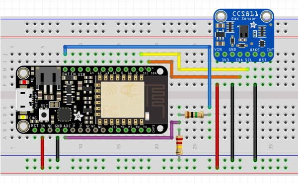
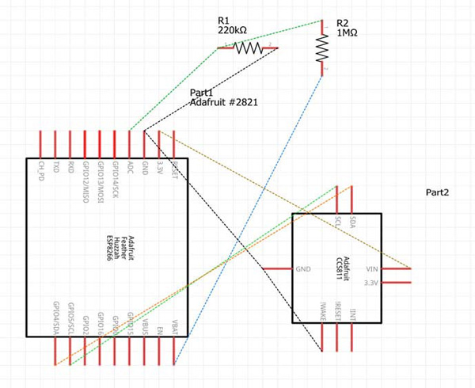

# WiFi Air Quality App with Data Logging

A WiFi Air Quality App with Data Logging intended for indoor air quality monitoring that can detect a wide range of carbon dioxide reading (eCO2) readings and Volatile Organic Compounds (VOCs) such as Alcohols, Aldehydes, Ketones, Organic Acids, Amines, Aliphatic and Aromatic Hydrocarbons.

The WiFi Air Quality App uses an Adafruit CCS811 Air Quality Sensor to take readings in real time and then transmit the data wirelessly via WiFi with the Adafruit Feather HUZZAH ESP8266 WiFi Development Board to a Firebase real-time cloud database, and then displaying the results using a React.js website interface.


__Project Status - In Process - Started, 8/25/2017 - Updated, 10/06/2017__

----

### Table of Contents

  -  WiFi Air Quality App Description
  -  Features to Have 
  -  Hardware Used for Project
  -  Schematic of Hardware Layout
  -  Code Used for Programming Hardware
  -  Website Technologies 
  -  How to Use This App
  -  File and Directory Structure
  -  Revision History

----

### WiFi Air Quality App Description
App & Device can be used to monitor indoor air quality conditions in agricultural, industrial or commercial applications and can be expanded to monitor numerous other types of data according to the need of the clients, market and or by sensors applied to the application. 

Project is to measure the Carbon Dioxide (eCO2) readings and Volatile Organic Compounds (VOCs) readings in real time with sensors and then transmit the data via WiFi to Firebase, a real-time cloud database, and then display the data using a React.JS website interface in real time.

----

### Features to Have:
- Use Firebase (a Backend-as-a-Service cloud storage), to store data on its real-time database to log data of Carbon Dioxide (eCO2) readings and Volatile Organic Compounds (VOCs) readings via WiFi
- Viewable results by a React.JS website interface
- Real time Carbon Dioxide (eCO2) and Volatile Organic Compounds (VOCs) monitoring as polled from sensor 
- Battery powered, portable device
- Battery voltage level indicator

----

### Hardware Used for Project

__<u>Parts List</u>__

- (1) Adafruit Feather HUZZAH ESP8266 WiFi Development Board with built in USB and battery charging  [Get @ Adafruit](https://www.adafruit.com/product/2821)
- (1) Adafruit CCS811 Air Quality Sensor Breakout Board - VOC and eCO2  [Get @ Adafruit](https://www.adafruit.com/product/3566)
- (1) 220K Ohm Resistor, 5%, 1/4 watt, Color code: Red, Red, Yellow, Gold
- (1) 1M Ohm Resistor, 5%, 1/4 watt, Color code: Brown, Black, Green, Gold

__<u>Breadboard Layout</u>__
 

----

### Schematic of Hardware Layout



----

### Code Used for Programming Hardware
Code used for programming the Adafruit Feather HUZZAH ESP8266 board is located in the directory  [feather_huzzah_esp8266_code](https://github.com/DKMitt/wifi-react-air-quality/tree/master/feather_huzzah_esp8266_code). 


__<u>Definition of Code</u>__

  * [esp8266_ccs811_test.ino](https://github.com/DKMitt/wifi-react-air-quality/blob/master/feather_huzzah_esp8266_code/esp8266_ccs811_test.ino)  -  Used to test hardware is setup correctly, sends data to serial monitor - Pulled code from Adafruit website with driver 
  
  * [esp8266_ccs811.ino](https://github.com/DKMitt/wifi-react-air-quality/blob/master/feather_huzzah_esp8266_code/esp8266_ccs811.ino)  -  Used to test hardware and Firebase Database are setup correctly, sends data to serial monitor and to Firebase database - In Process of Coding 10/08/2017
  

----

### Website Technologies

Description of website technologies used to develop this app.

- REACT Router 4.1.1
- REACT.JS based using [create-react-app](https://github.com/facebookincubator/create-react-app), currently it is a thin layer on top of many amazing community projects, such as:

- webpack with webpack-dev-server, html-webpack-plugin and style-loader
  Babel with ES6 and extensions used by Facebook (JSX, object spread, class properties)

- Autoprefixer

- Jest

- ESLint

- All of them are transitive dependencies of the provided npm package.

__<u>Dependecies</u>__
    firebase: 4.1.3,
    react: 15.6.1,
    react-dom: 15.6.1,
    react-router: 4.1.1,
    react-router-dom: 4.1.1

----


### How to Use This App

Description of how to use the app

To start the app use the following command

  "npm start"   - this Runs the app in development mode.

  Open http://localhost:3000 to view it in the browser.

----


### File and Directory Structure

```
.
├── feather_huzzah_esp8266_code
│   │
│   ├── esp8266_ccs811.ino
│   │
│   └── esp8266_ccs811_test.ino
│ 
├── public
│   │
│   ├── assets
│   │   │
│   │   └── img
│   │       │
│   │       ├── esp8266-ccs811+batlev.jpg
│   │       │
│   │       └── esp8266-ccs811+batlev-sch.jpg
│   │
│   ├── favicon.ico
│   │
│   ├── index.html
│   │
│   └── manifest.json
│
├── src
│   │
│   ├── img
│   │   │
│   │   └── 
│   │
│   ├── About.js
│   │
│   ├── App.css
│   │
│   ├── App.js
│   │
│   ├── App.test.js
│   │
│   ├── Home.js
│   │
│   ├── index.css
│   │
│   ├── index.js
│   │
│   └── registerServiceWorker.js
│ 
├── .gitignore
│
├── package.json
│
└── README.md            
```
----
### Revision History 

Description of revisions made to the app - In Process, last updated 10/7/2017

  - [x] Hardware / Dev - Breadboard Layout & Schematic - 8/26/2017  
  - [x] Dev - file and directory structure creation  - 8/26/2017
  - [x] Dev - Firebase cloud database creation - 8/26/2017
  - [ ] Dev - website wire framing -
  - [ ] Hardware - hardware assembly - 
  - [ ] Hardware / Dev - hardware coding & embedding - 
  - [ ] Hardware - configure & test to send data to Firebase database -    
  - [ ] Dev - website coding - 
  - [ ] Dev - file and directory structure cleanup - 
  - [ ] Dev - final testing - 
