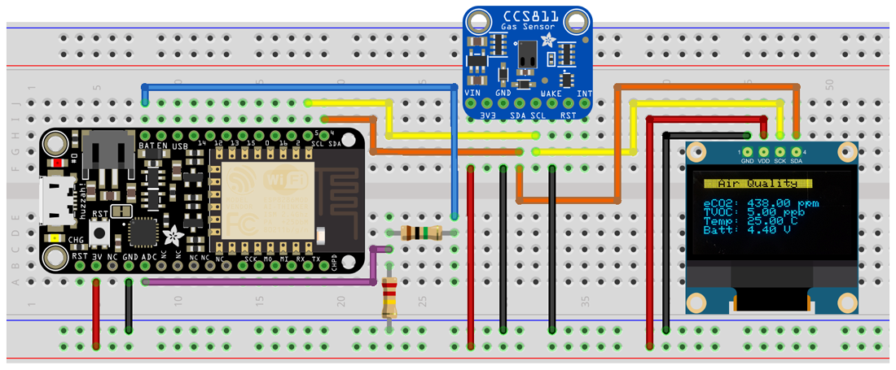
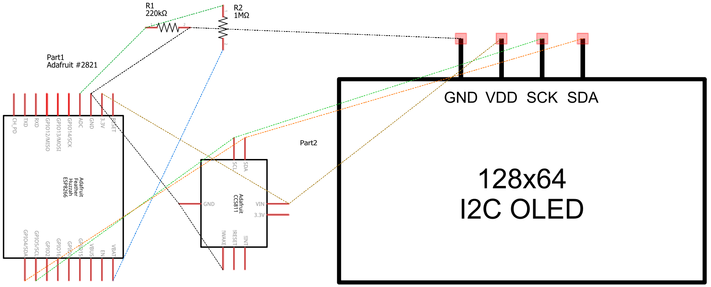
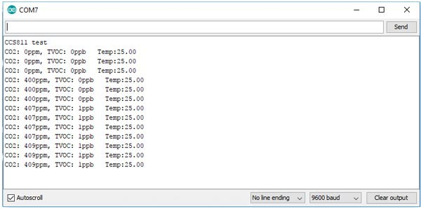
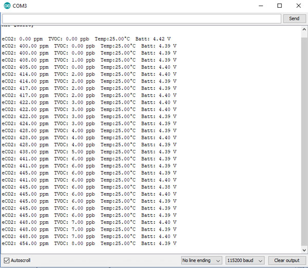
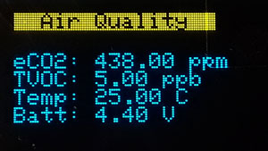

# WiFi Air Quality App with Data Logging

A WiFi Air Quality App with Data Logging intended for indoor air quality monitoring that can detect a wide range of carbon dioxide reading (eCO2) readings and Volatile Organic Compounds (VOCs) such as Alcohols, Aldehydes, Ketones, Organic Acids, Amines, Aliphatic and Aromatic Hydrocarbons.

The WiFi Air Quality App uses an Adafruit CCS811 Air Quality Sensor to take readings in real time and then transmit the data wirelessly via WiFi with the Adafruit Feather HUZZAH ESP8266 WiFi Development Board to a Firebase real-time cloud database, and then displaying the results using a React.js website interface.


__Project Status - In Process - Updated, 08/30/2018__

----

### Table of Contents

  -  WiFi Air Quality App Description
  -  Features to Have 
  -  Hardware Used for Project
  -  Breadboard & Schematic Layouts
  -  Code Used for Programming Hardware
  -  Website Technologies 
  -  The Build Process
  -  How to Use This App
  -  File and Directory Structure
  -  Revision History

----

### WiFi Air Quality App Description
App & Device can be used to monitor indoor air quality conditions in agricultural, industrial or commercial applications and can be expanded to monitor numerous other types of data according to the need of the clients, market and or by sensors applied to the application. 

Project is to measure the Carbon Dioxide (eCO2) readings and Volatile Organic Compounds (VOCs) readings in real time with sensors and then transmit the data via WiFi to Firebase, a real-time cloud database, and then display the data using a React.JS website interface in real time.

----

### Features to Have:
- Use Firebase (a Backend-as-a-Service cloud storage), to store data on its real-time database to log data of Carbon Dioxide (eCO2) readings and Volatile Organic Compounds (VOCs) readings via WiFi
- Viewable results by a React.JS website interface
- Real time Carbon Dioxide (eCO2) and Volatile Organic Compounds (VOCs) monitoring as polled from sensor 
- Battery powered, portable device
- Battery voltage level indicator

----

### Hardware Used for Project

__<u>Parts List</u>__

- (1) Adafruit Feather HUZZAH ESP8266 WiFi Development Board with built in USB and battery charging  [Get @ Adafruit](https://www.adafruit.com/product/2821)
- (1) Adafruit CCS811 Air Quality Sensor Breakout Board - VOC and eCO2  [Get @ Adafruit](https://www.adafruit.com/product/3566)
- (1) 220K Ohm Resistor, 5%, 1/4 watt, Color code: Red, Red, Yellow, Gold
- (1) 1M Ohm Resistor, 5%, 1/4 watt, Color code: Brown, Black, Green, Gold
- (1) SSD 1306 OLED Display, 0.96"  128x64

------

### Breadboard  & Schematic Layouts

Description of the breadboard and schematic layouts used as going thru the build process.

**ESP8266, CCS811 with Battery Divider Circuit** - 12/18/2017

Adafruit Feather HUZZAH ESP8266 WiFi Board wired up with a Battery Divider Circuit and the Adafruit CCS811 Air Quality Sensor Breakout Board.

 


------

**ESP8266, CCS811 & SSD1306 with Battery Divider Circuit** - 8/29/2018

Adafruit Feather HUZZAH ESP8266 WiFi Board wired up with a Battery Divider Circuit and the Adafruit CCS811 Air Quality Sensor Breakout Board and a SSD1306 OLED Display.

 





----

### Code Used for Programming Hardware

Code used for programming the Adafruit Feather HUZZAH ESP8266 board is located in the directory  [feather_huzzah_esp8266_code](https://github.com/DKMitt/wifi-react-air-quality/tree/master/feather_huzzah_esp8266_code). 


__<u>Definition of Code</u>__

  * [esp8266_ccs811_test.ino](https://github.com/DKMitt/wifi-react-air-quality/blob/master/feather_huzzah_esp8266_code/esp8266_ccs811_test.ino)  -  Used to test the ESP8266 with the CCS811 without the Battery Divider Circuit to send data to the serial monitor - Get code from within Arduino IDE by going to:
    __File->Examples->Adafruit_CCS811->CCS811_test__ 

    You should get the below output to your serial monitor

    

  * [esp8266_ccs811_ssd1306.ino](https://github.com/DKMitt/wifi-react-air-quality/blob/master/feather_huzzah_esp8266_code/esp8266_ccs811_ssd1306.ino)  -  Used to test the ESP8266 with the CCS811 and SSD1306 OLED 0.96" 128x64 Display without the Battery Divider Circuit - 8/29/2018

  * [esp8266_ccs811_ssd1306_batmon.ino](https://github.com/DKMitt/wifi-react-air-quality/blob/master/feather_huzzah_esp8266_code/esp8266_ccs811_ssd1306_batmon.ino)  -  Used to test the ESP8266  with the Battery Divider Circuit, the CCS811 and the SSD1306 OLED 0.96" 128x64 Display - 8/30/2018

    You should get something similar to the below Serial Monitor & SSD1306 OLED Display outputs

    





  * [esp8266_ccs811.ino](https://github.com/DKMitt/wifi-react-air-quality/blob/master/feather_huzzah_esp8266_code/esp8266_ccs811.ino)  -  Used to test hardware and Firebase Database are setup correctly, sends data to serial monitor and to Firebase database - Incomplete - Not Coded as of yet


__<u>Source for Code & Wiring</u>__

- [Adafruit CCS811 Air Quality Sensor Overview](https://learn.adafruit.com/adafruit-ccs811-air-quality-sensor/raspberry-pi-wiring-and-test?view=all)
- [Arduino Wiring & Test](https://learn.adafruit.com/adafruit-ccs811-air-quality-sensor/wiring-and-test)
- [Adafruit CCS811 Air Quality Sensor Downloads](https://learn.adafruit.com/adafruit-ccs811-air-quality-sensor?view=all#downloads)
- [Download Adafruit_CCS811 library](https://learn.adafruit.com/adafruit-ccs811-air-quality-sensor?view=all#download-adafruit-ccs811-library) - To begin reading sensor data, you will need to download Adafruit_CCS811 library, read more on how to do that here and download link.
- [Adafruit_feather HUZZAH ESP8266 Overview](https://learn.adafruit.com/adafruit-feather-huzzah-esp8266/pinouts?view=all#overview) - Covers working with the Adafruit feather HUZZAH ESP8266, pinout, wiring, programing, the battery voltage divider used here and more.
- [Using Arduino IDE to Program the Adafruit_feather HUZZAH ESP8266](https://learn.adafruit.com/adafruit-feather-huzzah-esp8266/pinouts?view=all#using-arduino-ide) - How to program the Adafruit feather HUZZAH ESP8266

----

### Website Technologies

Description of website technologies used to develop this app.

- REACT Router 4.1.1
- REACT.JS based using [create-react-app](https://github.com/facebookincubator/create-react-app), currently it is a thin layer on top of many amazing community projects, such as:

- webpack with webpack-dev-server, html-webpack-plugin and style-loader
  Babel with ES6 and extensions used by Facebook (JSX, object spread, class properties)

- Autoprefixer

- Jest

- ESLint

- All of them are transitive dependencies of the provided npm package.
  ​

__<u>Dependencies</u>__

    firebase: ^5.4.1
    istanbul-lib-hook: ^2.0.1
    react: ^15.6.1
    react-dom: ^15.6.1
    react-router: ^4.1.1
    react-router-dom: ^4.1.1

__<u>devDependencies</u>__

    react-scripts: ^1.1.5


------

### The Build Process

Description of how this project was started and the process of putting it together, this is not a tutorial.


------

### How to Use This App

Description of how to use the app

To start the app use the following command

  "npm start"   - this Runs the app in development mode.

  Open http://localhost:3000 to view it in the browser.

----

### File and Directory Structure

```
.
├── feather_huzzah_esp8266_code
│   │
│   ├── esp8266_ccs811.ino
│   │
│   ├── esp8266_ccs811_ssd1306.ino
│   │
│   ├── esp8266_ccs811_ssd1306_batmon.ino
│   │
│   └── esp8266_ccs811_test.ino
│ 
├── public
│   │
│   ├── assets
│   │   │
│   │   └── img
│   │       │
│   │       ├── ccs811-test-results-600.jpg
│   │       │
│   │       ├── esp8266-ccs811+batlev.jpg
│   │       │
│   │       ├── esp8266-ccs811+batlev-sch.jpg
│   │       │
│   │       ├── ESP8266-CCS811-SSD1306-Battery-Divder-bb.png
│   │       │
│   │       ├── ESP8266-CCS811-SSD1306-Battery-Divder-sm.jpg
│   │       │
│   │       ├── ESP8266-CCS811-SSD1306-Battery-Divider-schem.png
│   │       │
│   │       └── ssd1306-readings.jpg
│   │
│   ├── favicon.ico
│   │
│   ├── index.html
│   │
│   └── manifest.json
│
├── src
│   │
│   ├── img
│   │   │
│   │   └── 
│   │
│   ├── About.js
│   │
│   ├── App.css
│   │
│   ├── App.js
│   │
│   ├── App.test.js
│   │
│   ├── Home.js
│   │
│   ├── index.css
│   │
│   ├── index.js
│   │
│   └── registerServiceWorker.js
│ 
├── .gitignore
│
├── package.json
│
├── package-lock.json
│
└── README.md            
```

------

### Revision History 

Description of revisions made to the app - __In Process, last updated 8/30/2018__

  - [x] Hardware / Dev - Breadboard layout & schematic - 8/26/2017  
  - [x] Dev - File and directory structure creation  - 8/26/2017
  - [x] Dev - Firebase cloud database creation - 8/26/2017
  - [x] Hardware - Hardware assembly - 12/18/2017
  - [x] Hardware / Dev - Hardware coding - ESP8266, CCS811 - 12/18/2017
  - [x] Hardware / Dev - Hardware coding - ESP8266, CCS811 & SSD1306 - 8/29/2018
  - [x] Hardware / Dev - Hardware coding - ESP8266 with Battery Divider Circuit, CCS811 & SSD1306 - 8/30/2018
  - [ ] Hardware / Dev - Hardware coding & test to send data to Firebase database - 
  - [x] Dev - Update dependencies - 8/28/2018
  - [ ] Dev - Website wire framing -
  - [ ] Dev - Website coding - 
  - [ ] Dev - File and directory structure cleanup - 
  - [ ] Dev - Final testing - 
